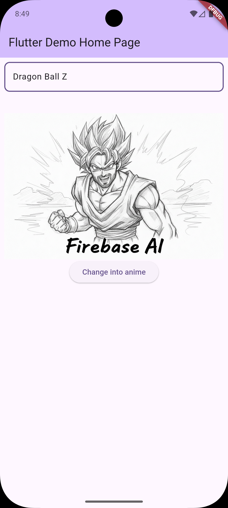

# Prompt Templates with Firebase AI & Dotprompt

A Flutter application demonstrating the use of Firebase AI for image generation with prompt templates using the dotprompt format.



## Features

- Image style transformation using Firebase AI
- Text-based prompt templates for anime-style image generation

## Setup Instructions

### Prerequisites

- Flutter SDK (latest stable version)
- Firebase project with AI features enabled
- Android Studio or VS Code with Flutter extensions

### Firebase Setup

1. **Create a Firebase Project:**
   - Go to [Firebase Console](https://console.firebase.google.com/)
   - Create a new project or use an existing one

2. **Enable Firebase AI:**
   - In Firebase Console, go to **Build** → **AI**
   - Enable Firebase AI for your project

3. **Enable Required APIs:**
   - Go to [Google Cloud Console](https://console.cloud.google.com/)
   - Navigate to **APIs & Services** → **Enabled APIs**
   - Enable:
     - Generative Language API

4. **Add Android App:**
   - In Firebase Console, click **Add app** → **Android**
   - Package name: `com.example.prompt_templates_firebase_flutter`
   - Download `google-services.json` and place it in `android/app/`

5. **Configure Firebase Options:**
   - The `firebase_options.dart` file is already configured with your project details
   - API key and other credentials are set up automatically

### Flutter Setup

1. **Clone or download the project:**
   ```bash
   git clone <repository-url>
   cd prompt_templates_firebase_flutter
   ```

2. **Install dependencies:**
   ```bash
   flutter pub get
   ```

3. **Add your image asset:**
   - Place an image file named `image.jpg` in the `assets/` directory
   - Update `pubspec.yaml` if needed to include the asset

4. **Run the app:**
   ```bash
   flutter run
   ```

## Usage

1. **Enter a style prompt:** Type a description of the desired anime style in the text field (e.g., "Naruto anime style", "Studio Ghibli", etc.)

2. **Generate image:** Click the "Change into anime" button to transform your image

3. **View result:** The processed image will appear below the input field

## Project Structure

```
lib/
├── main.dart              # Main application with image generation logic
├── firebase_options.dart  # Firebase configuration
└── ...

assets/
└── image.jpg             # Source image for transformation

android/app/
└── google-services.json  # Firebase Android configuration
```

## Dependencies

- `firebase_core`: Firebase initialization
- `firebase_ai`: Firebase AI for image generation
- `flutter`: UI framework

## Troubleshooting

### API Key Issues
- Ensure your Firebase project has AI features enabled
- Check that the Generative Language API is enabled in Google Cloud Console
- Verify the API key in `firebase_options.dart` matches your Firebase project

### Image Loading Issues
- Ensure `image.jpg` exists in the `assets/` directory
- Check that the asset is properly declared in `pubspec.yaml`

## Learn More

- [Firebase AI Documentation](https://firebase.google.com/docs/ai)
- [Flutter Documentation](https://docs.flutter.dev/)
- [Dotprompt Format Guide](https://firebase.google.com/docs/ai/dotprompt)
